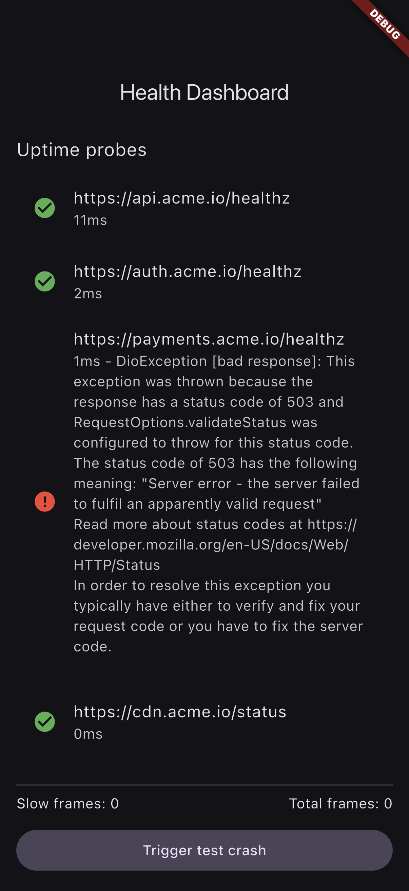
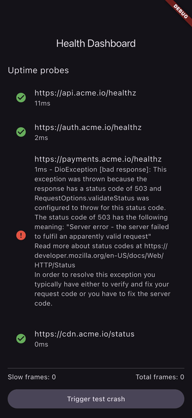

# flutter-app-monitoring

Flutter app ecosystem monitoring POC. Wires up the standard mobile observability stack so prod incidents are detected before users hit them, not after.

## Demo

Real captures from the running app on the iOS Simulator (no mockups). See [FLOW.md](FLOW.md) for how they were generated. The in-app health dashboard shows live uptime probes (note the degraded `payments` endpoint returning 503), frame counters, and the crash-reporting action that fans out to Sentry + Crashlytics.

| Health dashboard | Uptime probes | Crash reporting |
|---|---|---|
|  |  |  |



## What it monitors

| Signal | Source | Surfaces in |
|---|---|---|
| Native + Dart crashes | `sentry_flutter` | Sentry, Crashlytics |
| ANR / freezes | `firebase_crashlytics` + frame budget timer | Crashlytics |
| Jank / slow frames | `WidgetsBinding.addTimingsCallback` | Sentry custom metric |
| Network errors + slow APIs | Dio interceptor -> Sentry breadcrumbs | Sentry |
| Cold start time | Native trace + Firebase Performance | Firebase Performance |
| Backend uptime probes | Periodic HTTP HEAD to N endpoints | Local dashboard + Sentry |
| App lifecycle | `AppLifecycleState` listener | Breadcrumbs |
| Custom business events | `MonitoringClient.track(...)` | Sentry + Mixpanel-shaped sink |

## Architecture

```
lib/
  core/
    monitoring/
      monitoring_client.dart       # facade -> Sentry + Crashlytics + uptime
      sentry_setup.dart            # init + sample rate + tags
      crashlytics_setup.dart       # FlutterError.onError + zone guard
      performance_observer.dart    # frame timings + cold start
      uptime_prober.dart           # periodic HEAD with exponential backoff
      network_interceptor.dart     # Dio interceptor -> breadcrumbs
  features/
    dashboard/                     # in-app health dashboard (uptime, last crash, slow frames)
    health/                        # /healthz screen for QA + uptime checks
  main.dart                        # runZonedGuarded entrypoint
```

## Why this matters

Most mobile teams discover downtime via app store reviews. By the time a 1-star review lands, you have already lost the user. The pieces here move that detection window from "days" to "minutes":

- Crashes -> Sentry alert -> Slack within ~30s
- Backend down -> uptime prober flips, in-app banner + Sentry event
- Frame time p95 regresses -> Sentry metric alert on release

## Stack

- Flutter 3.24+, Dart 3.5+
- `sentry_flutter`, `firebase_crashlytics`, `firebase_performance`
- `dio` for HTTP + interceptor
- `flutter_riverpod` for state
